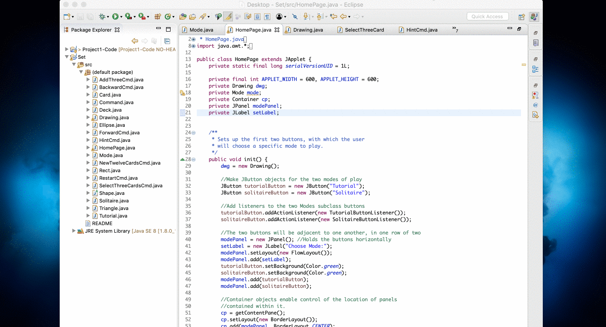

# set-card-game

An applet that lets users play the set card game. If you're a beginner, try out the Tutorial mode to learn what makes a set. Once you're comfortable, try out Solitaire mode and start finding sets all on your own.

## Table of Contents  
[Getting Started](#getting-started)

[Project Description](#project-description)

[Game Mode Explanation](#game-mode-explanation)

## Getting Started

1.  Clone the repo:

        git clone https://github.com/shinellm/set-card-game.git

2.  Open the project from your preferred Java editor.

3.  Navigate to the 'HomePage.java' file and run the project.

## Project Description
Implement an applet for the SET card game. The applet will have two operating modes, which are 
solitaire mode and tutorial mode.

For information on the SET rules, go to setgame.com to see the rules in the language of your choice. 
You can also play the Daily Set Puzzle (https://www.setgame.com/set/puzzle) or play other SET games 
at http://smart-games.org/en/set/start/

## Game Mode Explanation

#### Tutorial Mode:

In tutorial mode, the system deals 12 cards. Upon a suitable command from the user, the system will show all sets 
that are present in the 12 cards. When the user indicates readiness, the system will deal another 12 cards and repeat.

#### Solitaire Mode:

1. At start, the system deals 12 cards
2. Two possibilities:
    
    2a. Player specifies 3 cards which they think make up a set. If the 3 cards are a set they are removed 
    from play and replaced, and step 2 repeats. If the 3 cards are not a set, the system explains why not and 
    continues to wait for the player to choose a set.
    
    2b. Player cannot identify a set:
        
        Player can ask for 3 additional cards (to a total of 15, cannot ask for 3 more after that) and then play 
        returns to step 2, or
        
        Player asks the system to show a set. When Player approves the set, the cards are removed from play. If 
        at this point there are 12 cards remaining, play returns to step 2. If at this point there are 9 cards, 
        then 3 cards are dealt and play returns to step 2.
        
    2c. Play continues until the user quits the game or there are fewer than 12 cards total remaining in the 
    available deck. When all cards are used up, user should be given the option to play again or quit.
    
NOTE: The deck will not be in the same order every time a new game starts.

